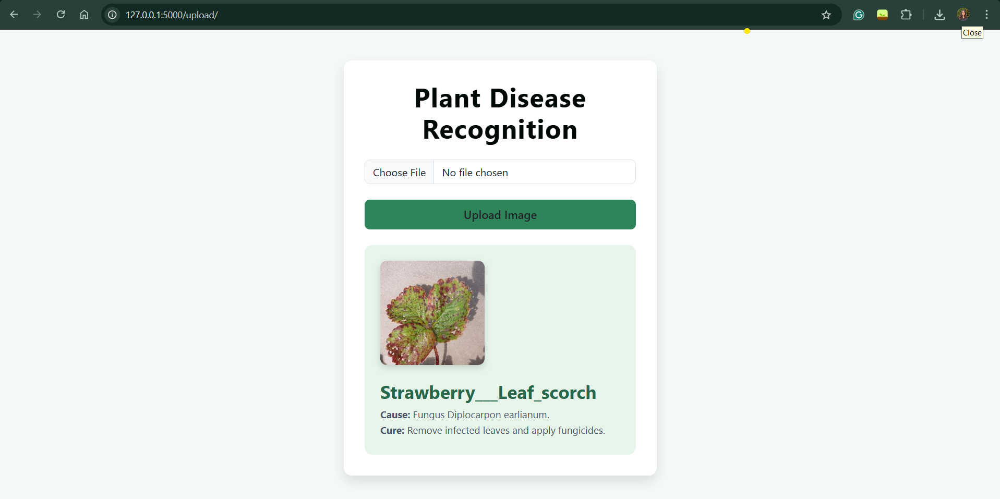

#  Plant Disease Recognition Web App

This is a web-based application for recognizing plant leaf diseases using deep learning. Users can upload an image of a plant leaf, and the system will classify the disease and provide possible causes and cures.

##  Features

- Upload plant leaf images via a user-friendly web interface  
- Get instant prediction of disease name, cause, and cure  
- Results displayed with image and formatted text  
- Responsive and visually appealing UI  

##  Model Used

This project utilizes **MobileNetV2**, a lightweight and efficient convolutional neural network architecture, pre-trained on ImageNet and fine-tuned for plant disease classification using transfer learning.

##  Tech Stack

- **Python** – Backend programming language used for server-side logic  
- **Flask** – Lightweight Python web framework to build the backend  
- **HTML/CSS** – Used to build and style the frontend structure  
- **Bootstrap 5** – For responsive and mobile-friendly UI components  
- **Jinja2** – Flask’s templating engine to render dynamic HTML  
- **MobileNetV2** – A pre-trained deep learning model (via Keras) used for efficient plant disease classification

##  Screenshot


##  Getting Started

   Clone the repository:
   ```bash
   git clone https://github.com/yourusername/plant-disease-recognition.git
   cd plant-disease-recognition
